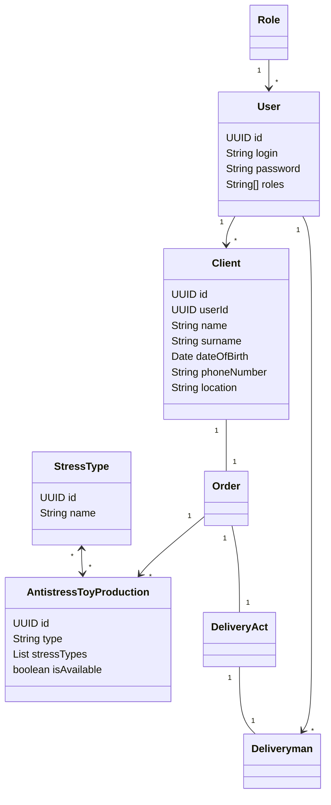

# Лабораторная работа №1

### Состав: 
Байрамова Хумай P34312  
Лисицина Василиса P34312

## Предметная область: Интернет-магазин попитов

### Пример архитектуры БД:

```mermaid
   classDiagram
   Order "1" --> "*" AntistressToyProduction
   Role "1" --> "*" User
   User "1" --> "*" Client
   User "1" --> "*" Deliveryman
   StressType "*" <--> "*" AntistressToyProduction 
   Client "1" -- "1" Order
   Order "1" -- "1" DeliveryAct
   DeliveryAct "1" -- "1" Deliveryman
   
   AntistressToyProduction : UUID id
   AntistressToyProduction : String type
   AntistressToyProduction : List<String> stressTypes
   AntistressToyProduction : boolean isAvailable
   
   StressType : UUID id
   StressType : String name
   
   User : UUID id
   User : String login
   User : String password 
   User : String[] roles
   
   Client : UUID id
   Client : UUID userId
   Client : String name
   Client : String surname
   Client : Date dateOfBirth
   Client : String phoneNumber
   Client : String location
   
   
   
   
   
   
```

